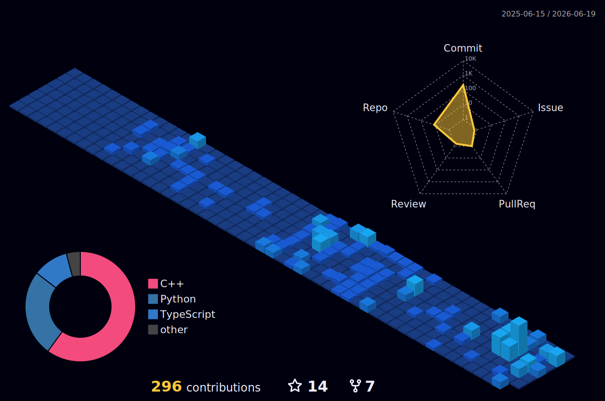

# Ruthu Rao

**Software Engineer | Forward-Deployed | Applied AI**

Building production systems: applied AI models → backend infrastructure → deployment at scale.

---

## 🏆 Featured Projects

**[DILI Prediction App](https://github.com/route-2/dili)** — FastAPI + BigQuery + Next.js clinical risk scoring (rule-based + LSTM)

**[MealPal Bot](https://github.com/route-2/meal-plan-be)** — Python RAG backend + NestJS orchestration (OCR, OAuth, Kroger integration)

**NAFLD Temporal Modeling** — Time-series ML system for longitudinal clinical data

**[ShareLock](https://devfolio.co/projects/sharelock-a43e)** — Shamir's Secret Sharing, MPC-based recovery (published NPM: `mpc-zksnap`)

| Hackathon Wins | |
|---|---|
| **CrossX** | Winner – CoinDCX Ventures Track • Warpspeed |
| **OFFSwap** | 1st Runner-Up – CoinDCX Ventures Track • Warpspeed |
| **Passync** | Top 3 – Safe & Base • ETHIndia 2023 |
| **ShareLock** | ETHIndia Fellowship 2023 |
| **Filecoin** | Bounty Winner – Destructuring IPFS |
| **ReKarma** | Warpspeed |
| **Asap.Finance** | ETHIndia Hackathon 2022 |
| **Salaried3** | Polygon & EPNS Pool Prize – Unfold 2022 |
| **E-Notary** | CoinSwitch Hackathon 2022 |
| **NFT Aggregator** | Encode Club Hackathon |
| **FlatFinder** | Gaekmayhem hack |

---

## 🛠️ Tech Stack
 
### Languages

 
### Backend & Infrastructure

 
### Frontend

 
### Data & ML/AI

 
### Databases & Cloud

 
### Tools & DevOps

 
---
 
---

## 📊 Contribution Graph

| Contribution Stats |
|---|
|  |

---

## 🎯 Skills & Interests

Software Engineer  •  Forward-deployed  • Applied AI in production • Clinical AI • High-reliability systems • Infrastructure at scale

---

## 🔗 Connect

[**Portfolio**](https://www.ruthurao.com/) • 
[**LinkedIn**](https://www.linkedin.com/in/ruthurao/) • 
[**Twitter/X**](https://twitter.com/RuthuRao) • 
[**GitHub**](https://github.com/route-2) •
[**LeetCode**](https://leetcode.com/route2/)

**📧 ruthurao@gmail.com**
