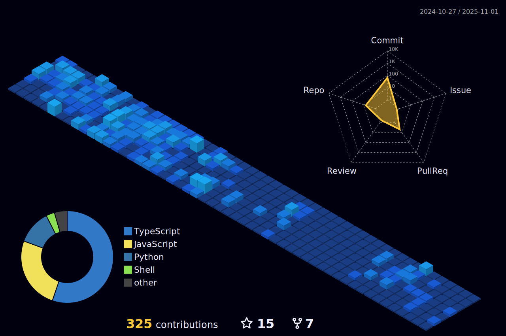

<h1 align="center"> </h1>

<h1 align="center">Hi 👋, I'm Ruthu Rao </h1>

  

|  Projects|Hackathons|
|-----------|---------|
| CrossX | Winner CoinDCX Ventures Track at Warpspeed |
| OFFSwap | 1st Runner up CoinDCX Ventures at Warpspeed |
| NFT Aggregator | Encode Club Hackathon |
| FlatFinder | Mern Stack  |
| ShareLock | EthIndia Fellowship 2023 |
| ReKarma-BramhaFiReact | WarpSpeed |
| FileCoin-Destructuring  IPFS  | Bounty Winner |
| E-notary | CoinSwitch Hackathon 2022 |
| Asap.Finance | ETHINDIA Hackathon 2022 |
| Salaried3 | (Polygon & EPNS Pool Prize) Unfold 2022 |
| Passync | (Safe and Base Top 3) ETHIndia 2023 |

- 🌱 I’m currently learning **Crypto, AI, Distributed systems and Computer architecture**

- 💬 Ask me about **Cryptography, Blockchain and Web-Dev**

- ⚡ fact: turning caffeine into code 

- 📫 How to reach me **ruthurao@gmail.com**

<h3 align="center"></h3>
<h3 align="center" > Connect with me: </h3>

  
  
 

<h3 align="center">Coding Profiles:</h3>

<h3 align="center">Languages and Tools:</h3>

  
  
  
  
  
  
  
  
  
  
  
  
  
  
  
  
  
  
 
 
 
 
 
 
 
 
 
 
 
 

<!---->

|🎯 Most used languages 🏆| 🏆 Github Stats 🔭|
|----------------------------------|----------------------------|
| | |

|  Contribution Stats  |
|----------------------|
|  |
